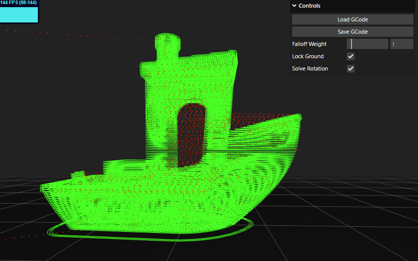

# [GFormer](https://zalo.github.io/GFormer/)

<p align="left">
  <a href="https://github.com/zalo/GFormer/deployments/activity_log?environment=github-pages">
      </a>
  <a href="https://github.com/zalo/GFormer/commits/master">
      </a>
  <!--<a href="https://github.com/zalo/GFormer/blob/master/LICENSE">
      </a>-->  <!-- No idea what license this should be! -->
</p>

Deform pre-sliced GCode for non-planar printing.

[](https://zalo.github.io/GFormer/)

[Inspired by CNC Kitchen](https://www.youtube.com/watch?v=0XaaUXOwzTs)

 # Building

This toy can either be run without building (in Chrome/Edge/Opera since raw three.js examples need [Import Maps](https://caniuse.com/import-maps)), or built with:
```
npm install
npm run build
```
If building manually, make sure to edit the index .html to point from `"./src/main.js"` to `"./build/main.js"`.

 # Dependencies
 - [three.js](https://github.com/mrdoob/three.js/) (3D Rendering Engine)
 - [esbuild](https://github.com/evanw/esbuild/) (Bundler)
